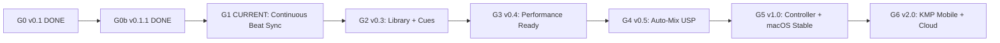

# FreeDeck Roadmap

High-performance cross-platform DJ software targeting Serato/Rekordbox-class parity on macOS first, then iOS and Android via Kotlin Multiplatform. The long-term differentiator is an **Auto-Mix engine**; the **immediate focus** is **Continuous Beat Sync**.

## Vision

FreeDeck uses a **Shared Brain** architecture: a single C++ audio engine powers every host (desktop Tauri, future mobile KMP). The UI is a thin control surface; all time-critical audio decisions run on the engine's real-time thread with minimal latency.

| Priority | Focus |
|----------|-------|
| Now | Continuous Beat Sync (G1) — industry-standard phase lock + variable beatgrids |
| Always | Latency — sub-10 ms control loop, Rubber Band delay compensation, RT-safe audio path |
| Later | Auto-Mix USP (G4), hardware (G5), mobile (G6) |

## Goal ladder



| Goal | Version | Status | Scope |
|------|---------|--------|-------|
| G0 | v0.1.0 | **Done** | 2-deck engine demo, one-shot TS sync |
| G0b | v0.1.1 | **Done** | Bipolar filter, trim/gain, engine snapshot telemetry, GeekDataPanel, DSP tests |
| **G1** | **v0.2.0** | **Current — immediate focus** | Continuous Beat Sync (Phases 1–4) |
| G2 | v0.3.0 | Next | Real local library, hot cues, loops |
| G3 | v0.4.0 | Planned | Remaining FX, headphone cue, recording |
| G4 | v0.5.0 | Planned | Auto-Mix engine (requires G1 beatgrids) |
| G5 | v1.0.0 | Planned | DDJ-FLX4 MIDI, 4-deck, macOS stable release |
| G6 | v2.0.0 | Planned | KMP mobile hosts, Supabase cloud sync |

**Advance rule:** Complete the current goal's Definition of Done, ship the mapped release, then move to the next goal. Do not start G2 until G1 Definition of Done passes.

---

## Current goal: G1 — Continuous Beat Sync

**Implementation plan:** [`.cursor/plans/continuous_beat_sync_ffd91553.plan.md`](.cursor/plans/continuous_beat_sync_ffd91553.plan.md)

**Requirements:** [`docs/superpowers/specs/2026-06-08-continuous-beat-sync-design.md`](docs/superpowers/specs/2026-06-08-continuous-beat-sync-design.md)

**Prerequisite:** Rubber Band time-stretch must be correct ([`docs/superpowers/plans/2026-06-08-tempo-layout-bpm-fix.md`](docs/superpowers/plans/2026-06-08-tempo-layout-bpm-fix.md)).

### Why this is G1

Today's sync is one-shot in TypeScript (`apps/desktop/src/lib/sync.ts`). Pressing SYNC computes tempo + seek once; master tempo changes trigger hard re-seeks in `App.tsx`. That drifts over minutes, causes audible jumps, and has no phase meter. Industry software (Serato, Rekordbox, Traktor, Mixxx) snaps once then **continuously corrects playback rate** every audio buffer.

### Phases and release gates

| Phase | Delivers | Release |
|-------|----------|---------|
| **P1** | C++ audio-thread proportional phase lock, `set_sync`/`set_master`/`set_beatgrid` FFI, Rubber Band delay compensation, RT-safe atomics | v0.2.0-alpha.1 |
| **P2** | Phase meter + MASTER/SYNCED LEDs via expanded telemetry | v0.2.0-alpha.2 |
| **P3** | Quantize toggle + snap-to-beat/bar on seek/cue/sync | v0.2.0-beta |
| **P4** | Variable beatgrid array (Ellis DP analysis), `engine_track_beats`, persistence, edit UI MVP | v0.2.1 |

### G1 TODO checklist

#### Phase 1 — Core continuous phase lock

- [ ] Add per-deck sync atomics: `native_bpm_`, `grid_offset_`, `sync_rate_trim_`, `nudge_offset_beats_`
- [ ] Add engine atomics: `master_deck_`, `sync_enabled_[2]`
- [ ] Implement phase detector with `getStartDelay()` latency compensation
- [ ] Implement Mixxx-style P-control (deadband 0.01, catch-up 0.20, Kp 0.7, slew ±2%/block, cap ±5%)
- [ ] Multiply `sync_rate_trim_` in `Deck::apply_stretch_settings`
- [ ] FFI: `set_sync`, `set_master`, `set_beatgrid` through engine.h → shim → bridge → lib.rs → engine.ts
- [ ] TS: initial `alignFollowerToMaster` snap, then `engine.setSync(true)`; remove master-tempo re-seek `useEffect`
- [ ] TS: nudge/pitch-bend as temporary offset with re-lock on release (Tempo Sync mode)
- [ ] RT hardening: remove `Deck::playback()` mutex from audio hot path
- [ ] RT hardening: move `ensure_playback_prepared` off audio thread
- [ ] RT hardening: explicit 128–256 sample device buffer
- [ ] Tests: `engine/test/sync_test.cpp` + extended `apps/desktop/src/lib/sync.test.ts`

#### Phase 2 — Phase meter + sync LEDs

- [ ] Extend `EngineSnapshot` with `sync_phase_error`, synced/master flags, `buffer_size_ms`
- [ ] Wire through Rust `TelemetryEvent` and `engine.ts` `Telemetry` type
- [ ] Build `PhaseMeter` component (centered sliding bar)
- [ ] Add MASTER / SYNCED / TEMPO-SYNC LED states in `TempoColumn`

#### Phase 3 — Quantize

- [ ] Add `snapToBeat` / `snapToBar` pure functions in `sync.ts` with unit tests
- [ ] Quantize toggle in UI
- [ ] Apply quantize to waveform seek, cue set, sync engage when enabled

#### Phase 4 — Variable / editable beatgrid

- [ ] Ellis DP beat tracking in `TrackAnalysis.cpp` → `beats[]` + downbeat indices
- [ ] `engine_track_beats(deck)` FFI command
- [ ] Lock-free swappable beat buffer (`shared_ptr<const vector<double>>`)
- [ ] Phase math from interpolated beat index (variable tempo)
- [ ] Per-track grid JSON persistence via Tauri fs
- [ ] Edit UI MVP: offset nudge, set-downbeat, BPM x2/÷2
- [ ] Tests: `engine/test/beatgrid_test.cpp` + TS persistence tests

### Definition of Done (G1 → G2)

- [ ] Two constant-BPM tracks stay phase-locked for 10+ minutes; residual error < 0.01 beat
- [ ] SYNC engage: one-shot phrase snap + continuous hold (no re-seek on master tempo change)
- [ ] Nudge/pitch-bend: temporary offset; P-control re-locks on release
- [ ] Phase meter shows live `sync_phase_error` from engine
- [ ] Variable-tempo test track locks via beat array (Phase 4)
- [ ] Zero new mutex/alloc in audio callback sync path
- [ ] `sync_test.cpp` + extended `sync.test.ts` green
- [ ] GeekDataPanel shows sync phase error + latency metrics

### Mathematical model (summary)

Proportional rate control on beat-fraction phase error (not a literal PLL — Rubber Band delay makes tight PLLs unstable):

```
beatDistance     = fractional position within current beat [0, 1)
phaseError       = shortestCircularDelta(master, follower)  // [-0.5, 0.5]
if |phaseError| < 0.01:  trim = 1.0
elif |phaseError| > 0.20: trim = 1.05
else:                     trim = 1.0 + (-phaseError × 0.7), slew-limited

followerRate = (masterBpm / followerLocalBpm) × trim × (1 + nudge)
audiblePos   = transportPos − stretcher.getStartDelay() / sampleRate
```

Variable grids use sparse `beats[]` in seconds; local BPM = `60 / (beats[i+1] - beats[i])`.

---

## Serato / Rekordbox parity matrix

| Feature | Serato/Rekordbox | FreeDeck today | G1 target |
|---------|------------------|----------------|-----------|
| 2-deck layout | Yes | Yes (UI shell) | — |
| Load local audio | Yes | Yes | — |
| Waveform + playhead | Yes | Yes | — |
| 3-band EQ | Yes | Yes | — |
| Filter knob | Yes | Yes (v0.1.1) | — |
| Trim/gain | Yes | Yes (v0.1.1) | — |
| Crossfader | Yes | Yes | — |
| Tempo / key-lock | Yes | Yes (Rubber Band) | — |
| **Beat Sync (continuous)** | Yes | One-shot TS only | **P1–P3** |
| **Phase meter** | Yes | No | **P2** |
| **Quantize** | Yes | No | **P3** |
| **Variable beatgrid** | Yes | Single offset only | **P4** |
| **Beatgrid edit** | Yes | No | **P4 MVP** |
| Hot cues | Yes | No | G2 |
| Loops | Yes | No | G2 |
| Music library | Yes | Mock data | G2 |
| FX rack | Yes | Filter only | G3 |
| Headphone cue | Yes | No | G3 |
| MIDI controller | Yes | No | G5 |
| Auto-mix | Partial | No | G4 (USP) |
| Mobile | Yes (Rekordbox) | No | G6 |

---

## Deferred (explicitly not G1)

- Real music library and SQLite persistence (G2)
- Hot cues and loops (G2)
- Echo/reverb/flanger FX (G3)
- Headphone cue / recording (G3)
- Auto-Mix engine (G4 — depends on G1 beatgrids + engine sync)
- DDJ-FLX4 MIDI ([`docs/DDJ-FLX4.md`](docs/DDJ-FLX4.md)) (G5)
- Kotlin Multiplatform mobile + Supabase sync (G6)
- Streaming sources (Apple Music, Tidal) — no timeline yet

---

## Related docs

| Document | Purpose |
|----------|---------|
| [`docs/ARCHITECTURE.md`](docs/ARCHITECTURE.md) | System design, DSP flow, sync control loop, latency |
| [`docs/RELEASING.md`](docs/RELEASING.md) | Version mapping, release checklist, branch hygiene |
| [`CHANGELOG.md`](CHANGELOG.md) | Version history |
| [`docs/superpowers/specs/2026-06-08-continuous-beat-sync-design.md`](docs/superpowers/specs/2026-06-08-continuous-beat-sync-design.md) | Beat sync requirements |
| [`.cursor/plans/continuous_beat_sync_ffd91553.plan.md`](.cursor/plans/continuous_beat_sync_ffd91553.plan.md) | Implementation tasks |
