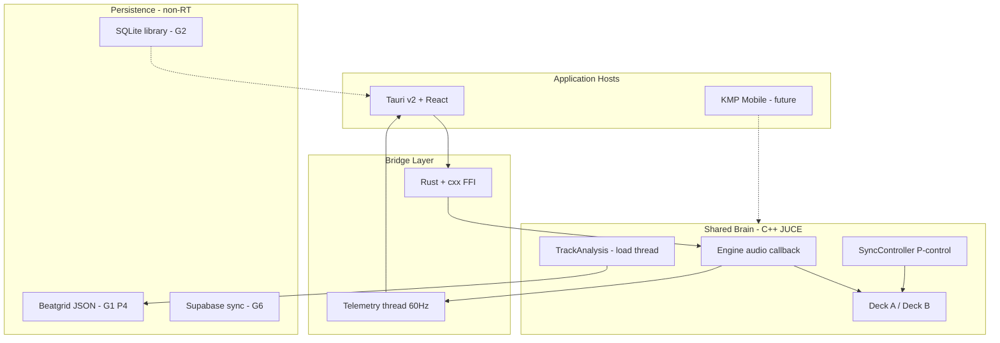
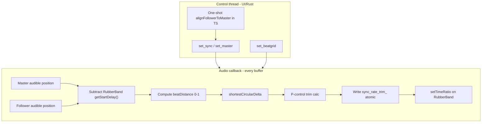
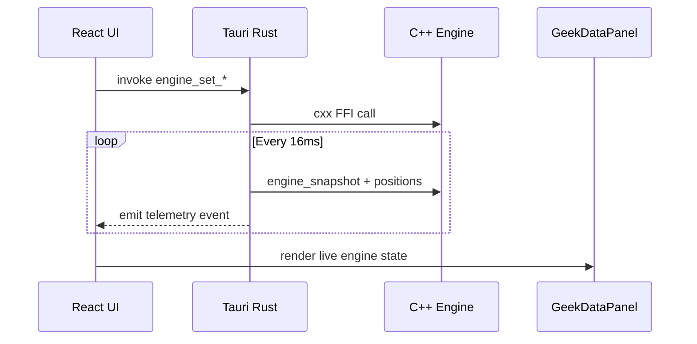
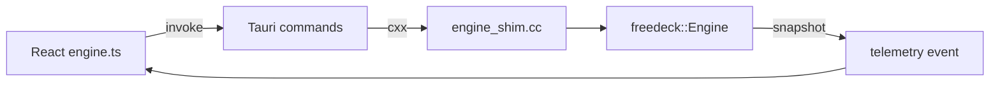
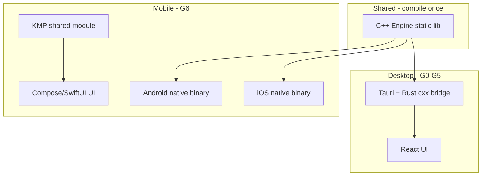

# FreeDeck Architecture

FreeDeck is a high-performance cross-platform DJ application built around a **Shared Brain**: one C++ audio engine shared by lightweight host applications (desktop Tauri today, Kotlin Multiplatform mobile later).

## Executive summary

The engine owns all real-time audio: playback, time-stretch, EQ, filtering, mixing, and (G1) continuous beat sync. The React UI sends commands through a Rust/cxx FFI bridge and receives ~60 Hz telemetry. Persistence (library, beatgrids, cues) is layered above the engine and must never block the audio thread.

**North-star:** Serato/Rekordbox-class desktop DJ, with Auto-Mix as the long-term USP.

**Immediate focus (G1):** Continuous Beat Sync — engine-owned proportional phase lock with variable beatgrids. See [`ROADMAP.md`](../ROADMAP.md).

---

## System overview



---

## Technology stack

| Layer | Technology |
|-------|------------|
| Audio engine | C++17 / JUCE (CoreAudio on macOS) |
| Time-stretch | Rubber Band (real-time, finer engine) |
| Desktop host | Tauri v2 |
| Desktop bridge | Rust + `cxx` (in-process, zero IPC) |
| Desktop UI | React 19 + Vite + Tailwind v4 |
| Mobile host (future) | Kotlin Multiplatform |
| Local data (future) | SQLite + JSON sidecars |
| Cloud sync (future) | Supabase PostgreSQL |

---

## As-built DSP signal flow

Per-deck chain (linear, not a formal node graph):

```mermaid
flowchart LR
    reader[AudioFormatReader] --> transport[AudioTransportSource]
    transport --> stretch[TimeStretch RubberBand]
    stretch --> trim[Trim gain]
    trim --> eq[ThreeBandEq]
    eq --> filter[DjFilter bipolar]
    filter --> vol[Volume gain]
    vol --> mix[Engine mixer]
    mix --> xf[Crossfader equal-power]
    xf --> limiter[Soft limiter tanh]
    limiter --> out[CoreAudio output]
```



**G1 addition:** `SyncController` writes `sync_rate_trim_` into `TimeStretch` ratio each audio block for synced follower decks.

Key files:

| Component | Path |
|-----------|------|
| Engine callback | `engine/src/Engine.cpp` |
| Per-deck chain | `engine/src/Deck.cpp` |
| Time-stretch | `engine/src/TimeStretch.cpp` |
| EQ | `engine/src/Eq.cpp` |
| Filter | `engine/src/Filter.cpp` |
| Crossfader | `engine/src/Mixer.h` |
| Analysis | `engine/src/TrackAnalysis.cpp` |

---

## Continuous sync control loop (G1 target)

Sync runs **only** on the audio callback thread. The UI sets intent (`set_sync`, `set_master`, `set_beatgrid`); the engine holds phase.



### Mathematical model

**Beat distance** (fractional position within current beat):

```
// Constant BPM:
beatDistance = ((audiblePos - gridOffset) / (60 / effectiveBpm)) mod 1.0

// Variable grid (G1 P4):
i = upper_bound(beats[], audiblePos) - 1
beatDistance = (audiblePos - beats[i]) / (beats[i+1] - beats[i])
localBpm = 60 / (beats[i+1] - beats[i])
```

**Phase error** (shortest path on the beat circle):

```
phaseError = shortestCircularDelta(masterBeatDistance, followerBeatDistance)
// result in [-0.5, 0.5] beat fractions
```

**Proportional rate correction** (Mixxx-style, not literal PLL):

```
if |phaseError| < 0.01:     trim = 1.0      // deadband
elif |phaseError| > 0.20:  trim = 1.05     // catch-up cap
else:
  raw   = 1.0 + (-phaseError * 0.7)
  delta = clamp(raw - lastTrim, -0.02, 0.02)
  trim  = clamp(lastTrim + delta, 0.95, 1.05)

followerDjRatio = (masterEffectiveBpm / followerLocalBpm) * trim * (1 + nudge)
rubberBandTimeRatio = 1.0 / followerDjRatio
```

**Audible position** (latency compensation):

```
audiblePos = transportPosition - (stretcher->getStartDelay() / sampleRate)
```

Industry references: [Mixxx SyncLock](https://github.com/mixxxdj/mixxx/wiki/Developer-Guide-SyncLock), [Serato SYNC](https://support.serato.com/hc/en-us/articles/203056994-SYNC-with-Serato-DJ), [Rubber Band integration](https://breakfastquay.com/rubberband/integration.html).

---

## Telemetry and observability



Current telemetry (~60 Hz) includes per-deck peaks, volume, trim, filter, EQ, tempo, key-lock, crossfader gains, and transport state. **G1 adds:** `sync_phase_error`, synced/master flags, `buffer_size_ms`.

Files: `engine/include/freedeck/EngineSnapshot.h`, `apps/desktop/src-tauri/src/lib.rs`, `apps/desktop/src/components/GeekDataPanel.tsx`.

---

## Bridge layer (desktop)



Tauri commands (current): `engine_start`, `engine_load_track`, `engine_set_play`, `engine_cue`, `engine_seek`, `engine_set_volume`, `engine_set_eq`, `engine_set_filter`, `engine_set_trim`, `engine_set_tempo`, `engine_set_key_lock`, `engine_set_crossfader`, `engine_waveform_peaks`, `engine_track_analysis`.

**G1 adds:** `engine_set_sync`, `engine_set_master`, `engine_set_beatgrid`, `engine_track_beats`.

All transport/mixer state flows through engine setters so MIDI hardware (G5) can call the same API. See [`docs/DDJ-FLX4.md`](DDJ-FLX4.md).

---

## Threading model

| Thread | Responsibility | RT-safe? |
|--------|----------------|----------|
| JUCE audio callback | Mix decks, stretch, EQ, filter, sync P-control, limiter | **Must be** |
| Tauri command handlers | Engine mutations via `parking_lot::Mutex` | No |
| Telemetry thread | Poll snapshot + positions every 16 ms | No |
| Load/analysis (G1 target) | Track analysis, beatgrid DP, waveform peaks | No |
| React UI | Render, user input, one-shot sync snap | No |

### Target vs as-built (latency)

| Rule | Target | As-built (v0.1.1) | G1 action |
|------|--------|-------------------|-----------|
| No mutex on audio path | Atomic reads only | `Deck::playback()` locks `load_mutex_` every block | Atomic `shared_ptr` playback |
| No alloc on audio path | Pre-allocated buffers | `TimeStretch` may resize vectors; `ensure_playback_prepared` on audio thread | Pre-allocate in `prepareToPlay`; prepare on load thread |
| Explicit buffer size | 128–256 samples | JUCE default (unknown) | Set in `Engine::start_audio`; expose in telemetry |
| Sync on audio thread | Every buffer | One-shot TS at UI event rate | P-control in `Engine::audioDeviceIOCallback` |
| Rubber Band delay comp | Audible position for phase | `getStartDelay()` tracked but not used for sync | Phase detector uses compensated position |
| Load does not block audio | Background analysis | `Deck::load` holds mutex during sync analysis | Background thread + atomic grid publish |

**Design principle:** The architecture doc previously claimed "strictly lock-free ring buffers." That is the **target** state. The **as-built** engine uses atomics for parameters but mutex-protected playback handles. G1 sync work includes closing this gap on the audio hot path.

---

## Beatgrid data model

### Today (v0.1.x)

```cpp
// engine/include/freedeck/TrackAnalysis.h
float beatgrid_offset_seconds;  // single first-beat offset
float bpm;                      // global BPM
```

### G1 target (variable grid)

```cpp
std::vector<double> beats;       // monotonic seconds, one per detected beat
std::vector<uint32_t> downbeats; // indices into beats[] where bar starts
```

Runtime storage: `std::shared_ptr<const std::vector<double>>` swapped atomically on the Deck. Large arrays are fetched via `engine_track_beats(deck)` at load time, not in the 60 Hz snapshot.

Persistence (G1 P4): JSON sidecar per track file path via Tauri fs.

Analysis: Ellis dynamic-programming beat tracking on the onset envelope at load time ([paper](https://www.ee.columbia.edu/~dpwe/pubs/Ellis07-beattrack.pdf)).

---

## Multi-platform future (G6)



The C++ core is the single source of truth for DSP and sync. Mobile hosts link the engine directly (no WebView). Cloud sync (Supabase) replicates library metadata and beatgrids, not audio streams.

---

## Auto-Mix engine (G4 — future USP)

Depends on G1 beatgrids and engine-side sync. Will use phrase detection (4/8/16/32 bar), transition scheduling, and automated crossfade + EQ + tempo alignment. Analysis infrastructure from `TrackAnalysis.cpp` extends into phrase boundary detection. Not started.

---

## Related documents

- [`ROADMAP.md`](../ROADMAP.md) — goals, current TODOs, parity matrix
- [`docs/RELEASING.md`](RELEASING.md) — version mapping and release checklist
- [`docs/DDJ-FLX4.md`](DDJ-FLX4.md) — MIDI hardware integration (G5)
- [`docs/superpowers/specs/2026-06-08-continuous-beat-sync-design.md`](superpowers/specs/2026-06-08-continuous-beat-sync-design.md) — beat sync requirements
