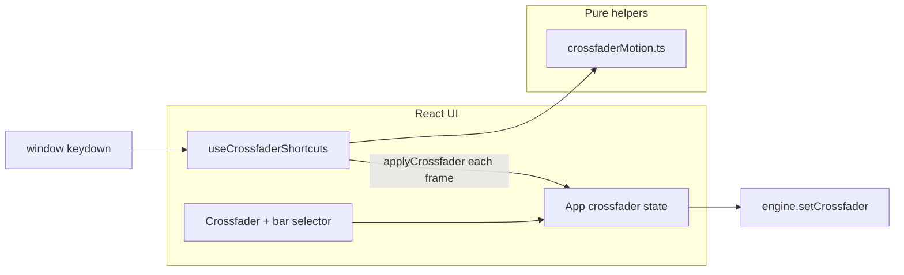

# Crossfader Keyboard Shortcuts Implementation Plan

> **For agentic workers:** REQUIRED SUB-SKILL: Use superpowers:subagent-driven-development (recommended) or superpowers:executing-plans to implement this plan task-by-task. Steps use checkbox (`- [ ]`) syntax for tracking.

**Goal:** Add keyboard shortcuts to control the crossfader (instant snaps via Cmd+arrows, bar-timed sweeps via plain Left/Right arrows) and a UI selector for sweep duration in bars (2/4/8/16/32).

**Architecture:** Pure functions in `crossfaderMotion.ts` handle BPM math and shortcut matching (testable, no React). A `useCrossfaderShortcuts` hook listens on `window`, drives `requestAnimationFrame` sweeps, and calls a shared `applyCrossfader` setter in `App.tsx` that updates React state and the C++ engine. Bar timing uses loaded deck BPM (adjusted by tempo slider) when available, else 128 BPM.

**Tech Stack:** React 19, TypeScript, Vitest, Tauri bridge (`engine.setCrossfader`), Tailwind CSS 4.

---

## File map

| File | Responsibility |
|------|----------------|
| `apps/desktop/src/lib/crossfaderMotion.ts` | Positions, duration math, BPM resolution, shortcut matching, input-focus guard |
| `apps/desktop/src/lib/crossfaderMotion.test.ts` | Unit tests for all pure functions |
| `apps/desktop/src/hooks/useCrossfaderShortcuts.ts` | Global keydown listener + rAF animation loop |
| `apps/desktop/src/App.tsx` | `applyCrossfader`, `crossfaderSweepBars` state, hook wiring, library metadata |
| `apps/desktop/src/components/Crossfader.tsx` | Bar-count `<select>` UI |
| `apps/desktop/src/components/Mixer.tsx` | Pass sweep-bars props through to Crossfader |
| `apps/desktop/src/components/TrackInfoBar.tsx` | `bpm: number \| null` type + display |
| `apps/desktop/src/components/Library.tsx` | Pass `LibraryTrack` metadata on double-click load |

**No engine/C++ changes.** `set_crossfader` already accepts per-frame updates.

---

## Shortcut spec

| Input | Action |
|-------|--------|
| `Cmd+↑` / `Ctrl+↑` | Snap to center (`0`) |
| `Cmd+Shift+←` / `Ctrl+Shift+←` | Snap to full A (`-1`) |
| `Cmd+Shift+→` / `Ctrl+Shift+→` | Snap to full B (`+1`) |
| `←` (no modifiers) | Animate `+1` → `-1` over N bars |
| `→` (no modifiers) | Animate `-1` → `+1` over N bars |

N = `crossfaderSweepBars` (default `8`, options `2 | 4 | 8 | 16 | 32`).

**Guards:** Skip when `event.target` is `input`, `textarea`, `select`, or `contenteditable`. Call `preventDefault()` on handled keys. Cancel in-progress sweep when any new shortcut fires.

**BPM resolution priority:**

1. Deck A playing with known BPM → `bpmA * tempoA`
2. Deck B playing with known BPM → `bpmB * tempoB`
3. Average effective BPM of all loaded decks with known BPM
4. Fallback `128`

**Duration formula (4/4):** `durationMs = bars * 4 * (60_000 / effectiveBpm)`

At 128 BPM, 8 bars ≈ 15,000 ms.

---

## Architecture diagram



---

### Task 1: Pure crossfader motion helpers

**Files:**
- Create: `apps/desktop/src/lib/crossfaderMotion.ts`
- Create: `apps/desktop/src/lib/crossfaderMotion.test.ts`
- Test: `apps/desktop/src/lib/crossfaderMotion.test.ts`

- [ ] **Step 1: Write the failing tests**

Create `apps/desktop/src/lib/crossfaderMotion.test.ts`:

```ts
import { describe, it, expect } from "vitest";
import {
  CROSSFADER_POSITIONS,
  DEFAULT_CROSSFADER_BPM,
  SWEEP_BAR_OPTIONS,
  barsToDurationMs,
  clampCrossfader,
  isEditableTarget,
  lerpCrossfader,
  matchCrossfaderShortcut,
  resolveCrossfaderBpm,
  type CrossfaderShortcutAction,
} from "./crossfaderMotion";

function keyEvent(
  key: string,
  opts: { metaKey?: boolean; ctrlKey?: boolean; shiftKey?: boolean; target?: EventTarget | null } = {},
): KeyboardEvent {
  return {
    key,
    metaKey: opts.metaKey ?? false,
    ctrlKey: opts.ctrlKey ?? false,
    shiftKey: opts.shiftKey ?? false,
    target: opts.target ?? document.body,
  } as KeyboardEvent;
}

describe("barsToDurationMs", () => {
  it("converts 8 bars at 128 BPM to 15000ms", () => {
    expect(barsToDurationMs(8, 128)).toBe(15_000);
  });

  it("scales linearly with bar count", () => {
    expect(barsToDurationMs(4, 128)).toBe(7_500);
    expect(barsToDurationMs(16, 128)).toBe(30_000);
  });
});

describe("resolveCrossfaderBpm", () => {
  it("prefers playing deck A BPM adjusted by tempo", () => {
    expect(
      resolveCrossfaderBpm({
        bpmA: 120,
        bpmB: 140,
        tempoA: 1.1,
        tempoB: 1,
        playingA: true,
        playingB: false,
      }),
    ).toBeCloseTo(132);
  });

  it("falls back to playing deck B when A is not playing", () => {
    expect(
      resolveCrossfaderBpm({
        bpmA: 120,
        bpmB: 140,
        tempoA: 1,
        tempoB: 0.9,
        playingA: false,
        playingB: true,
      }),
    ).toBeCloseTo(126);
  });

  it("averages loaded decks when neither is playing", () => {
    expect(
      resolveCrossfaderBpm({
        bpmA: 120,
        bpmB: 140,
        tempoA: 1,
        tempoB: 1,
        playingA: false,
        playingB: false,
      }),
    ).toBe(130);
  });

  it("returns default when no BPM known", () => {
    expect(
      resolveCrossfaderBpm({
        bpmA: null,
        bpmB: null,
        tempoA: 1,
        tempoB: 1,
        playingA: false,
        playingB: false,
      }),
    ).toBe(DEFAULT_CROSSFADER_BPM);
  });
});

describe("matchCrossfaderShortcut", () => {
  const cases: Array<[string, Partial<KeyboardEvent>, CrossfaderShortcutAction]> = [
    ["Cmd+Up → center", { key: "ArrowUp", metaKey: true }, "snap-center"],
    ["Ctrl+Up → center", { key: "ArrowUp", ctrlKey: true }, "snap-center"],
    ["Cmd+Shift+Left → left", { key: "ArrowLeft", metaKey: true, shiftKey: true }, "snap-left"],
    ["Cmd+Shift+Right → right", { key: "ArrowRight", metaKey: true, shiftKey: true }, "snap-right"],
    ["Left → sweep left", { key: "ArrowLeft" }, "sweep-left"],
    ["Right → sweep right", { key: "ArrowRight" }, "sweep-right"],
  ];

  it.each(cases)("%s", (_label, partial, expected) => {
    expect(matchCrossfaderShortcut(keyEvent(partial.key!, partial))).toBe(expected);
  });

  it("ignores plain ArrowUp", () => {
    expect(matchCrossfaderShortcut(keyEvent("ArrowUp"))).toBeNull();
  });

  it("ignores Cmd+Left without Shift", () => {
    expect(matchCrossfaderShortcut(keyEvent("ArrowLeft", { metaKey: true }))).toBeNull();
  });

  it("ignores when target is an input", () => {
    const input = document.createElement("input");
    expect(matchCrossfaderShortcut(keyEvent("ArrowLeft", { target: input }))).toBeNull();
  });
});

describe("lerpCrossfader and clampCrossfader", () => {
  it("lerps linearly", () => {
    expect(lerpCrossfader(-1, 1, 0)).toBe(-1);
    expect(lerpCrossfader(-1, 1, 0.5)).toBe(0);
    expect(lerpCrossfader(-1, 1, 1)).toBe(1);
  });

  it("clamps to range", () => {
    expect(clampCrossfader(2)).toBe(1);
    expect(clampCrossfader(-2)).toBe(-1);
  });
});

describe("constants", () => {
  it("exports expected positions and bar options", () => {
    expect(CROSSFADER_POSITIONS).toEqual({ left: -1, center: 0, right: 1 });
    expect(SWEEP_BAR_OPTIONS).toEqual([2, 4, 8, 16, 32]);
  });
});
```

- [ ] **Step 2: Run test to verify it fails**

Run from repo root:

```bash
cd apps/desktop && pnpm test src/lib/crossfaderMotion.test.ts
```

Expected: FAIL — module `./crossfaderMotion` not found.

- [ ] **Step 3: Write minimal implementation**

Create `apps/desktop/src/lib/crossfaderMotion.ts`:

```ts
export const CROSSFADER_POSITIONS = { left: -1, center: 0, right: 1 } as const;
export const DEFAULT_CROSSFADER_BPM = 128;
export const SWEEP_BAR_OPTIONS = [2, 4, 8, 16, 32] as const;
export type SweepBarCount = (typeof SWEEP_BAR_OPTIONS)[number];

export type CrossfaderShortcutAction =
  | "snap-center"
  | "snap-left"
  | "snap-right"
  | "sweep-left"
  | "sweep-right";

export type ResolveCrossfaderBpmInput = {
  bpmA: number | null;
  bpmB: number | null;
  tempoA: number;
  tempoB: number;
  playingA: boolean;
  playingB: boolean;
};

const BEATS_PER_BAR = 4;

export function barsToDurationMs(bars: number, bpm: number): number {
  const safeBpm = bpm > 0 ? bpm : DEFAULT_CROSSFADER_BPM;
  return (bars * BEATS_PER_BAR * 60_000) / safeBpm;
}

export function resolveCrossfaderBpm(input: ResolveCrossfaderBpmInput): number {
  const effectiveA = input.bpmA != null ? input.bpmA * input.tempoA : null;
  const effectiveB = input.bpmB != null ? input.bpmB * input.tempoB : null;

  if (input.playingA && effectiveA != null) return effectiveA;
  if (input.playingB && effectiveB != null) return effectiveB;

  const known: number[] = [];
  if (effectiveA != null) known.push(effectiveA);
  if (effectiveB != null) known.push(effectiveB);
  if (known.length === 1) return known[0]!;
  if (known.length === 2) return (known[0]! + known[1]!) / 2;

  return DEFAULT_CROSSFADER_BPM;
}

export function isEditableTarget(target: EventTarget | null): boolean {
  if (!(target instanceof HTMLElement)) return false;
  const tag = target.tagName;
  if (tag === "INPUT" || tag === "TEXTAREA" || tag === "SELECT") return true;
  return target.isContentEditable;
}

function hasCommandModifier(event: KeyboardEvent): boolean {
  return event.metaKey || event.ctrlKey;
}

export function matchCrossfaderShortcut(event: KeyboardEvent): CrossfaderShortcutAction | null {
  if (isEditableTarget(event.target)) return null;

  const cmd = hasCommandModifier(event);
  const { key, shiftKey } = event;

  if (cmd && key === "ArrowUp" && !shiftKey) return "snap-center";
  if (cmd && shiftKey && key === "ArrowLeft") return "snap-left";
  if (cmd && shiftKey && key === "ArrowRight") return "snap-right";

  if (!cmd && !shiftKey && !event.altKey) {
    if (key === "ArrowLeft") return "sweep-left";
    if (key === "ArrowRight") return "sweep-right";
  }

  return null;
}

export function lerpCrossfader(from: number, to: number, t: number): number {
  return from + (to - from) * t;
}

export function clampCrossfader(value: number): number {
  return Math.max(CROSSFADER_POSITIONS.left, Math.min(CROSSFADER_POSITIONS.right, value));
}
```

- [ ] **Step 4: Run test to verify it passes**

```bash
cd apps/desktop && pnpm test src/lib/crossfaderMotion.test.ts
```

Expected: all tests PASS.

- [ ] **Step 5: Commit**

```bash
git add apps/desktop/src/lib/crossfaderMotion.ts apps/desktop/src/lib/crossfaderMotion.test.ts
git commit -m "feat(desktop): add crossfader motion helpers and unit tests"
```

---

### Task 2: Crossfader shortcuts hook

**Files:**
- Create: `apps/desktop/src/hooks/useCrossfaderShortcuts.ts`

- [ ] **Step 1: Create the hook**

Create `apps/desktop/src/hooks/useCrossfaderShortcuts.ts`:

```ts
import { useEffect, useRef } from "react";
import {
  CROSSFADER_POSITIONS,
  barsToDurationMs,
  clampCrossfader,
  lerpCrossfader,
  matchCrossfaderShortcut,
  resolveCrossfaderBpm,
  type CrossfaderShortcutAction,
  type ResolveCrossfaderBpmInput,
  type SweepBarCount,
} from "../lib/crossfaderMotion";

export type UseCrossfaderShortcutsOptions = {
  sweepBars: SweepBarCount;
  bpmInput: ResolveCrossfaderBpmInput;
  onCrossfader: (value: number) => void;
};

function sweepEndpoints(action: "sweep-left" | "sweep-right"): { from: number; to: number } {
  if (action === "sweep-left") {
    return { from: CROSSFADER_POSITIONS.right, to: CROSSFADER_POSITIONS.left };
  }
  return { from: CROSSFADER_POSITIONS.left, to: CROSSFADER_POSITIONS.right };
}

function snapValue(action: Extract<CrossfaderShortcutAction, `snap-${string}`>): number {
  switch (action) {
    case "snap-center":
      return CROSSFADER_POSITIONS.center;
    case "snap-left":
      return CROSSFADER_POSITIONS.left;
    case "snap-right":
      return CROSSFADER_POSITIONS.right;
  }
}

export function useCrossfaderShortcuts({
  sweepBars,
  bpmInput,
  onCrossfader,
}: UseCrossfaderShortcutsOptions): void {
  const onCrossfaderRef = useRef(onCrossfader);
  const sweepBarsRef = useRef(sweepBars);
  const bpmInputRef = useRef(bpmInput);
  const rafRef = useRef<number | null>(null);

  onCrossfaderRef.current = onCrossfader;
  sweepBarsRef.current = sweepBars;
  bpmInputRef.current = bpmInput;

  const cancelSweep = () => {
    if (rafRef.current != null) {
      cancelAnimationFrame(rafRef.current);
      rafRef.current = null;
    }
  };

  const startSweep = (action: "sweep-left" | "sweep-right") => {
    cancelSweep();
    const { from, to } = sweepEndpoints(action);
    const bpm = resolveCrossfaderBpm(bpmInputRef.current);
    const durationMs = barsToDurationMs(sweepBarsRef.current, bpm);
    const start = performance.now();

    const tick = (now: number) => {
      const t = Math.min(1, (now - start) / durationMs);
      const value = clampCrossfader(lerpCrossfader(from, to, t));
      onCrossfaderRef.current(value);
      if (t < 1) {
        rafRef.current = requestAnimationFrame(tick);
      } else {
        rafRef.current = null;
      }
    };

    onCrossfaderRef.current(from);
    rafRef.current = requestAnimationFrame(tick);
  };

  useEffect(() => {
    const onKeyDown = (event: KeyboardEvent) => {
      const action = matchCrossfaderShortcut(event);
      if (!action) return;

      event.preventDefault();
      cancelSweep();

      if (action === "sweep-left" || action === "sweep-right") {
        startSweep(action);
        return;
      }

      onCrossfaderRef.current(snapValue(action));
    };

    window.addEventListener("keydown", onKeyDown);
    return () => {
      window.removeEventListener("keydown", onKeyDown);
      cancelSweep();
    };
  }, []);
}
```

- [ ] **Step 2: Verify TypeScript compiles**

```bash
cd apps/desktop && pnpm exec tsc --noEmit
```

Expected: no errors (if `tsc` not configured, skip — hook will be validated when App compiles).

- [ ] **Step 3: Commit**

```bash
git add apps/desktop/src/hooks/useCrossfaderShortcuts.ts
git commit -m "feat(desktop): add useCrossfaderShortcuts hook with rAF sweeps"
```

---

### Task 3: Track BPM type + Library metadata

**Files:**
- Modify: `apps/desktop/src/components/TrackInfoBar.tsx`
- Modify: `apps/desktop/src/components/Library.tsx`
- Modify: `apps/desktop/src/App.tsx`

- [ ] **Step 1: Update DeckTrackInfo BPM type**

In `apps/desktop/src/components/TrackInfoBar.tsx`, change:

```ts
export type DeckTrackInfo = {
  title: string;
  artist: string;
  bpm: number | null;
  key: string;
};
```

And update the BPM display line (around line 57):

```tsx
<span className="font-mono text-zinc-300">
  {track?.bpm != null ? track.bpm : "--"}
</span>
```

- [ ] **Step 2: Pass library track on double-click**

In `apps/desktop/src/components/Library.tsx`, update the props type:

```ts
type LibraryProps = {
  onLoadToDeck: (deck: 0 | 1, track?: LibraryTrack) => void;
  activeDeckA?: string | null;
  activeDeckB?: string | null;
};
```

Update `handleRowDoubleClick`:

```ts
const handleRowDoubleClick = (track: LibraryTrack) => {
  setSelectedId(track.id);
  onLoadToDeck(targetDeck, track);
};
```

Update the row `title` tooltip:

```tsx
title="Double-click to load to target deck"
```

- [ ] **Step 3: Update loadDeck in App.tsx**

Add import at top of `App.tsx`:

```ts
import type { LibraryTrack } from "./lib/mockLibrary";
import { SWEEP_BAR_OPTIONS, type SweepBarCount } from "./lib/crossfaderMotion";
import { useCrossfaderShortcuts } from "./hooks/useCrossfaderShortcuts";
```

Add state after existing crossfader state:

```ts
const [crossfaderSweepBars, setCrossfaderSweepBars] = useState<SweepBarCount>(8);
```

Replace `loadDeck` callback:

```ts
const loadDeck = useCallback(async (deck: 0 | 1, libraryTrack?: LibraryTrack) => {
  if (deck === 0) {
    setPeaksA([]);
    setTrackA(null);
  } else {
    setPeaksB([]);
    setTrackB(null);
  }

  const path = await engine.pickAndLoadTrack(deck);
  if (!path) return;

  const meta = engine.titleFromPath(path);
  const info: DeckTrackInfo = {
    title: libraryTrack?.title ?? meta.title,
    artist: libraryTrack?.artist ?? meta.artist,
    bpm: libraryTrack?.bpm ?? null,
    key: libraryTrack?.key ?? "--",
  };
  const peaks = await engine.getWaveformPeaks(deck);
  if (deck === 0) {
    setTrackA(info);
    setPeaksA(peaks);
  } else {
    setTrackB(info);
    setPeaksB(peaks);
  }
}, []);
```

Fix the existing `loadDeck` body that sets `bpm: "--"` — that line is removed by the above.

- [ ] **Step 4: Commit**

```bash
git add apps/desktop/src/components/TrackInfoBar.tsx apps/desktop/src/components/Library.tsx apps/desktop/src/App.tsx
git commit -m "feat(desktop): wire library BPM metadata into deck track info"
```

---

### Task 4: Wire hook and applyCrossfader in App.tsx

**Files:**
- Modify: `apps/desktop/src/App.tsx`

- [ ] **Step 1: Add applyCrossfader and hook**

In `App.tsx`, after state declarations and before `return`, add:

```ts
const applyCrossfader = useCallback((value: number) => {
  const clamped = Math.max(-1, Math.min(1, value));
  setCrossfader(clamped);
  engine.setCrossfader(clamped);
}, []);

useCrossfaderShortcuts({
  sweepBars: crossfaderSweepBars,
  bpmInput: {
    bpmA: trackA?.bpm ?? null,
    bpmB: trackB?.bpm ?? null,
    tempoA,
    tempoB,
    playingA: telemetry.deck_a_playing,
    playingB: telemetry.deck_b_playing,
  },
  onCrossfader: applyCrossfader,
});
```

- [ ] **Step 2: Replace inline onCrossfader handlers**

Change Mixer prop from:

```tsx
onCrossfader={(v) => {
  setCrossfader(v);
  engine.setCrossfader(v);
}}
```

To:

```tsx
onCrossfader={applyCrossfader}
crossfaderSweepBars={crossfaderSweepBars}
onCrossfaderSweepBarsChange={setCrossfaderSweepBars}
```

- [ ] **Step 3: Commit**

```bash
git add apps/desktop/src/App.tsx
git commit -m "feat(desktop): wire crossfader keyboard shortcuts in App"
```

---

### Task 5: Crossfader bar-count UI

**Files:**
- Modify: `apps/desktop/src/components/Crossfader.tsx`
- Modify: `apps/desktop/src/components/Mixer.tsx`

- [ ] **Step 1: Update Crossfader component**

Replace `apps/desktop/src/components/Crossfader.tsx` with:

```tsx
import { SWEEP_BAR_OPTIONS, type SweepBarCount } from "../lib/crossfaderMotion";
import { HorizontalFader } from "./HorizontalFader";

type CrossfaderProps = {
  value: number;
  sweepBars: SweepBarCount;
  onChange: (value: number) => void;
  onSweepBarsChange: (bars: SweepBarCount) => void;
};

export function Crossfader({ value, sweepBars, onChange, onSweepBarsChange }: CrossfaderProps) {
  return (
    <div className="w-full">
      <HorizontalFader label="Crossfader" value={value} min={-1} max={1} onChange={onChange} />
      <div className="mx-auto flex w-full max-w-md items-center justify-between px-4">
        <span className="text-[10px] text-zinc-600">A</span>
        <label className="flex items-center gap-1.5 text-[10px] text-zinc-500">
          <span>Sweep bars</span>
          <select
            value={sweepBars}
            onChange={(e) => onSweepBarsChange(Number(e.target.value) as SweepBarCount)}
            className="rounded border border-zinc-700 bg-zinc-900 px-2 py-0.5 text-xs text-zinc-300"
            aria-label="Crossfader sweep duration in bars"
          >
            {SWEEP_BAR_OPTIONS.map((bars) => (
              <option key={bars} value={bars}>
                {bars}
              </option>
            ))}
          </select>
        </label>
        <span className="text-[10px] text-zinc-600">B</span>
      </div>
    </div>
  );
}
```

- [ ] **Step 2: Thread props through Mixer**

In `apps/desktop/src/components/Mixer.tsx`:

Add to `MixerProps`:

```ts
import type { SweepBarCount } from "../lib/crossfaderMotion";

// inside MixerProps:
crossfaderSweepBars: SweepBarCount;
onCrossfaderSweepBarsChange: (bars: SweepBarCount) => void;
```

Destructure in function signature and update Crossfader usage:

```tsx
<Crossfader
  value={crossfader}
  sweepBars={crossfaderSweepBars}
  onChange={onCrossfader}
  onSweepBarsChange={onCrossfaderSweepBarsChange}
/>
```

- [ ] **Step 3: Commit**

```bash
git add apps/desktop/src/components/Crossfader.tsx apps/desktop/src/components/Mixer.tsx
git commit -m "feat(desktop): add crossfader sweep bar count selector"
```

---

### Task 6: Verification

**Files:** (none — run commands only)

- [ ] **Step 1: Run unit tests**

```bash
cd apps/desktop && pnpm test
```

Expected: all tests PASS including `crossfaderMotion.test.ts`.

- [ ] **Step 2: Manual smoke test in Tauri**

```bash
cd apps/desktop && pnpm tauri dev
```

Checklist:

1. `Cmd+↑` (or `Ctrl+↑`) snaps crossfader to center instantly.
2. `Cmd+Shift+←` snaps to full A (`-1`).
3. `Cmd+Shift+→` snaps to full B (`+1`).
4. `←` animates right → left; `→` animates left → right.
5. At default 8 bars / 128 BPM, full sweep takes ~15 seconds.
6. Changing sweep bars to `2` makes sweep ~4× faster than `8`.
7. Double-click a library row (e.g. BPM 114), load a file, play deck — sweep duration reflects that BPM.
8. Focus library search input — arrow keys do **not** trigger crossfader sweeps.
9. Pressing a new shortcut during an active sweep cancels and starts the new action.

- [ ] **Step 3: Final commit (if any fixups)**

Only if verification required small fixes.

---

## Self-review checklist

| Spec requirement | Task |
|------------------|------|
| Cmd+Up = middle | Task 1 (`snap-center`), Task 2 |
| Cmd+Shift+Right = right | Task 1 (`snap-right`), Task 2 |
| Cmd+Shift+Left = left | Task 1 (`snap-left`), Task 2 |
| Left arrow = sweep right→left over N bars | Task 1 (`sweep-left`), Task 2 |
| Right arrow = sweep left→right over N bars | Task 1 (`sweep-right`), Task 2 |
| Bar options 2/4/8/16/32 | Task 1 (`SWEEP_BAR_OPTIONS`), Task 5 |
| Deck BPM when available, else 128 | Task 1 (`resolveCrossfaderBpm`), Task 3 |
| Ignore shortcuts in editable fields | Task 1 (`isEditableTarget`) |
| Cancel sweep on new shortcut | Task 2 (`cancelSweep`) |

No placeholders remain. Type names are consistent across all tasks.

---

## Post-implementation follow-up

**Status: Implemented** (subagent-driven, 2026-06-08). All 23 vitest tests pass.

**One fix still needed** (found in final review): ignore `event.repeat` for sweep shortcuts in `useCrossfaderShortcuts.ts` so held arrow keys don't restart the sweep:

```ts
if (event.repeat && (action === "sweep-left" || action === "sweep-right")) {
  return;
}
```

Place after `preventDefault()` and before `cancelSweep()`.

Optional polish: use `clampCrossfader` in `App.tsx` `applyCrossfader`; add tests for `textarea`/`select` editable targets and Ctrl+Shift shortcuts.

---

## Execution handoff

Plan complete and saved to `docs/superpowers/plans/2026-06-08-crossfader-keyboard-shortcuts.md`.

**Two execution options:**

1. **Subagent-Driven (recommended)** — dispatch a fresh subagent per task, review between tasks, fast iteration. REQUIRED SUB-SKILL: `superpowers:subagent-driven-development`.

2. **Inline Execution** — execute tasks in this session using `superpowers:executing-plans`, batch execution with checkpoints.

**Which approach?**
